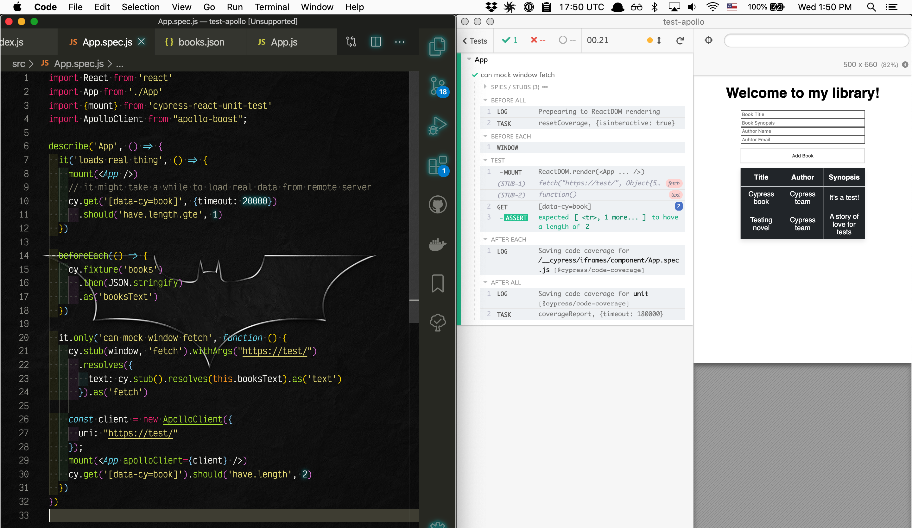
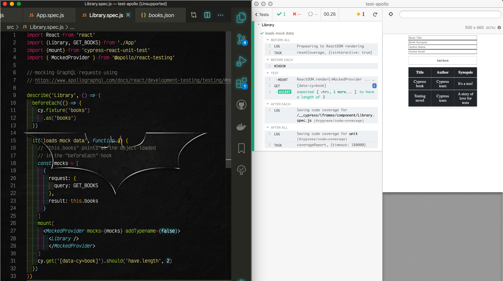
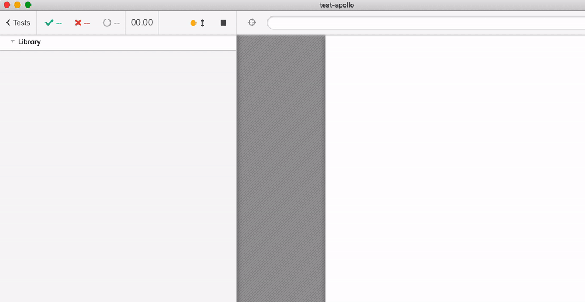

# test-apollo   [![renovate-app badge][renovate-badge]][renovate-app] [![ci status][ci image]][ci url]

> Testing React Apollo demo using Cypress component testing

The app copied from blog post [Apollo Client and Local State Management](https://blog.soshace.com/apollo-client-and-local-state-management/) with source code at [codesandbox.io](https://codesandbox.io/s/relaxed-rain-4xco8).

Uses [cypress-react-unit-test](https://github.com/bahmutov/cypress-react-unit-test)

You can also use [MockProvider](https://www.apollographql.com/docs/react/development-testing/testing/#mockedprovider)

Test | Description
--- | ---
[src/App.spec.js](src/App.spec.js) | Tests an application by stubbing `window.fetch` with a fixture to send back on GraphQL request from the component
[src/Library.spec.js](src/Library.spec.js) | Wraps `Library` component with `MockedProvider` from [Apollo testing library](https://www.apollographql.com/docs/react/development-testing/testing/#mockedprovider)

[renovate-badge]: https://img.shields.io/badge/renovate-app-blue.svg
[renovate-app]: https://renovateapp.com/
[ci image]: https://github.com/bahmutov/test-apollo/workflows/ci/badge.svg?branch=master
[ci url]: https://github.com/bahmutov/test-apollo/actions
